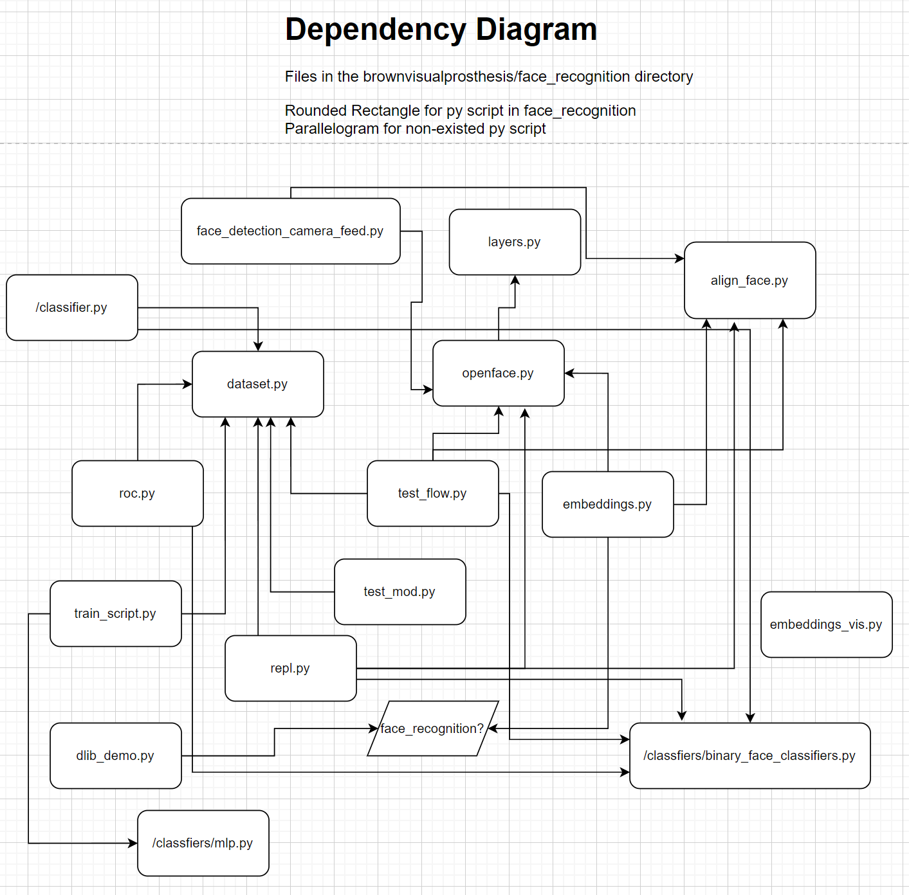

# Face Recognition

## Summary

1. scripts in repo are all in Python
2. brownvisualprosthesis/face_recognition/data includes generated npy (NumPy files) and html,  should be used for testing
3. not checked: 
    1. brownvisualprosthesis/face_recognition/legacy 
    2. brownvisualprosthesis/face_recognition/depricated
4. public modules are shown in brownvisualprosthesis/face_recognition/requirements.txt
5. Dependency diagram for files in the brownvisualprosthesis/face_recognition directory

## Problems:

1. unit-testing is hard (or could be skipped?): sklearn(scikit-learn) too old, current version 0.0, which was released in 2015 → seems not compatible with Mac with m1 chip, needs ssh for remote control
2. too much generated npys and htmls, which are considered to be generated in testing

## Questions:

1. Is zmq used as both a client and a server, as in one module in vp, namely face recognition here?
2. More reference for integration with vp modules are desired
